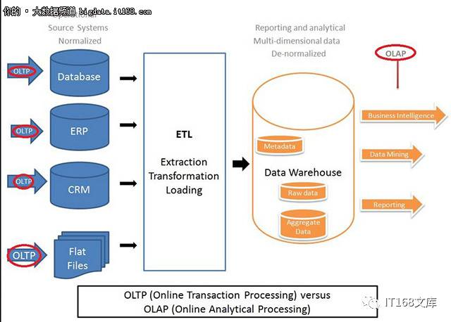
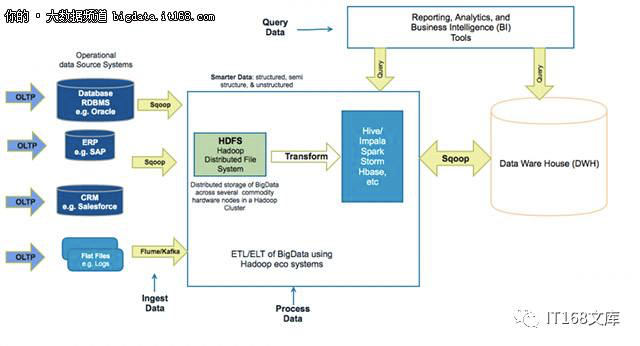
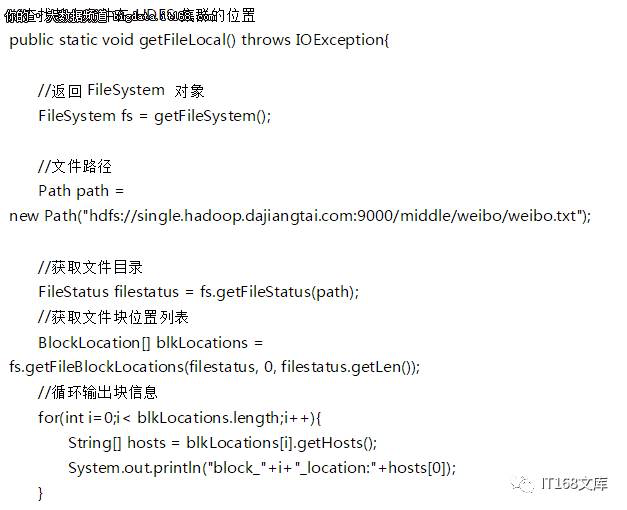

# Hadoop面试题

1、海量日志数据提取出某日访问百度次数最多的IP，怎么做?

2、有一个1G大小的文件，里面每一行是一个词，词的大小不超过16字节，内存限制大小是1M。返回频数最高的100个词。

3、更智能&更大的数据中心架构与传统的数据仓库架构有何不同?

传统的企业数据仓库架构

基于 Hadoop 的数据中心架构

4、运行Hadoop集群需要哪些守护进程?

DataNode，NameNode，TaskTracker和JobTracker都是运行Hadoop集群需要的守护进程。

5、Hadoop支持哪些操作系统部署?

Hadoop的主要操作系统是Linux。 但是，通过使用一些额外的软件，也可以在Windows平台上部署，但这种方式不被推荐。

6、Hadoop常见输入格式是什么?

三种广泛使用的输入格式是：

-文本输入：Hadoop中的默认输入格式。

-Key值：用于纯文本文件

-序列：用于依次读取文件

7、RDBMS和Hadoop的主要区别是什么?

RDBMS用于事务性系统存储和处理数据，而Hadoop可以用来存储大量数据。

8、给定a、b两个文件，各存放50亿个url，每个url各占64字节，内存限制是4G，让你找出a、b文件共同的URL?

9、如何在生产环境中部署Hadoop的不同组件?

需要在主节点上部署jobtracker和namenode，然后在多个从节点上部署datanode。

10、添加新datanode后，作为Hadoop管理员需要做什么?

需要启动平衡器才能在所有节点之间重新平均分配数据，以便Hadoop集群自动查找新的datanode。要优化集群性能，应该重新启动平衡器以在数据节点之间重新分配数据。

11、namenode的重要性是什么?

namenonde的作用在Hadoop中非常重要。它是Hadoop的大脑，主要负责管理系统上的分配块，还为客户提出请求时的数据提供特定地址。

12、判断：Block Size是不可以修改的。(错误)

13、当NameNode关闭时会发生什么?

如果NameNode关闭，文件系统将脱机。

14、是否可以在不同集群之间复制文件?如果是的话，怎么能做到这一点?

是的，可以在多个Hadoop集群之间复制文件，这可以使用分布式复制来完成。

15、是否有任何标准方法来部署Hadoop?

现在有使用Hadoop部署数据的标准程序，所有Hadoop发行版都没有什么通用要求。但是，对于每个Hadoop管理员，具体方法总是不同的。

16、HDFS，replica如何定位?

17、distcp是什么?

Distcp是一个Hadoop复制工具，主要用于执行MapReduce作业来复制数据。 Hadoop环境中的主要挑战是在各集群之间复制数据，distcp也将提供多个datanode来并行复制数据。

18、什么是检查点?

检查点是一种采用FsImage的方法。它编辑日志并将它们压缩成一个新的FsImage。因此，不用重放一个编辑日志，NameNode可以直接从FsImage加载到最终的内存状态，这肯定会降低NameNode启动时间。

19、什么是机架感知?

这是一种决定如何根据机架定义放置块的方法。Hadoop将尝试限制存在于同一机架中的datanode之间的网络流量。为了提高容错能力，名称节点会尽可能把数据块的副本放到多个机架上。 综合考虑这两点的基础上Hadoop设计了机架感知功能。

20、有哪些重要的Hadoop工具?

“Hive”，HBase，HDFS，ZooKeeper，NoSQL，Lucene / SolrSee，Avro，Oozie，Flume，Clouds和SQL是一些增强大数据性能的Hadoop工具。

21、什么是投机性执行?

如果一个节点正在执行比主节点慢的任务。那么就需要在另一个节点上冗余地执行同一个任务的一个实例。所以首先完成的任务会被接受，另一个可能会被杀死。这个过程被称为“投机执行”。

22、Hadoop及其组件是什么?

当“大数据”出现问题时，Hadoop发展成为一个解决方案。这是一个提供各种服务或工具来存储和处理大数据的框架。这也有助于分析大数据，并做出用传统方法难以做出的商业决策。

23、Hadoop的基本特性是什么?

　Hadoop框架有能力解决大数据分析的许多问题。它是基于Google大数据文件系统的Google MapReduce设计的。

24、是否可以在Windows上运行Hadoop?

可以，但是最好不要这么做，Red Hat Linux或者是Ubuntu才是Hadoop的最佳操作系统。在Hadoop安装中，Windows通常不会被使用，因为会出现各种各样的问题。因此，Windows绝不是Hadoop推荐系统。

25、主动和被动“名称节点”是什么?

在HA(高可用性)架构中，我们有两个NameNodes - Active“NameNode”和被动“NameNode”。

  　· 活动“NameNode”是在集群中运行的“NameNode”。

· 被动“NameNode”是一个备用的“NameNode”，与“NameNode”有着相似的数据。

当活动的“NameNode”失败时，被动“NameNode”将替换群集中的活动“NameNode”。因此，集群永远不会没有“NameNode”，所以它永远不会失败。