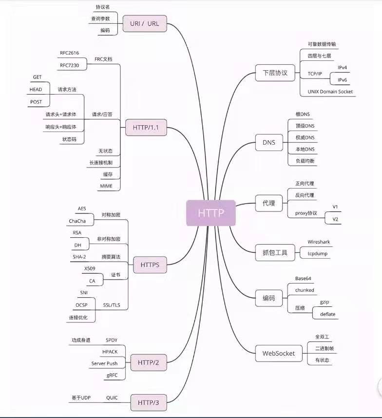

# 计算机网络

## 基础知识

## 计算机网络面试

### 面试题

1. https 中 ssl/tls 能否对 header 加密？ 能对header 和 body 加密，ssl/tls 是在socket上的封装，socket工作在 tcp/ip 传输层之上，可以认为是工作在会话层。对上层应用层的内容无差别地完全封装后传递给下层。

### 题目汇总

1. [计算机网络面试题汇总](计算机网络面试题.md)

