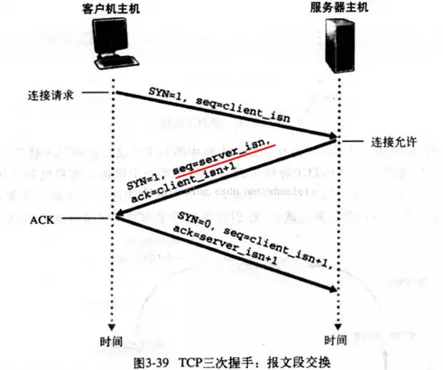
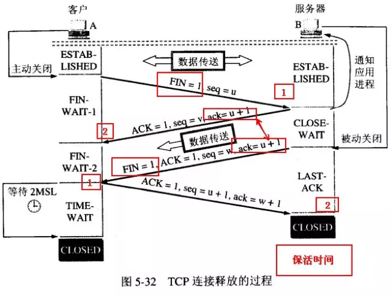

1. 五层协议的体系结构分别是什么？每一层都有哪些协议？

- 技术点：网络模型、协议
- 思路：分条解释每层名字以及协议
- 参考回答：
  - 物理层
  - 数据链路层：逻辑链路控制LLC、媒体接入控制MAC
  - 网络层：IP协议、地址解析协议ARP、逆地址解析协议RARP、因特网控制报文协议ICMP
  - 传输层：传输控制协议TCP、用户数据报协议UDP
  - 应用层：文件传输协议FTP、远程登录协议TELNET、超文本传输协议HTTP、域名系统DNS、简单邮件协议SMTP、简单网络管理协议SNMP

1. 为何有MAC地址还要IP地址？

- 技术点：MAC地址、IP地址
- 参考回答：
  - 每台主机在出厂时都有一个唯一的MAC地址，但是IP地址的分配是根据网络的拓朴结构，得以保证路由选择方案建立在网络所处的拓扑位置基础而不是设备制造商的基础上
  - 使用IP地址更方便数据传输。数据包在这些节点之间的移动都是由ARP协议负责将IP地址映射到MAC地址上来完成的。
- TCP

1. TCP和UDP的区别？

- 技术点：传输层协议对比
- 参考回答：
  - TCP传输控制协议：面向连接；使用全双工的可靠信道；提供可靠的服务，即无差错、不丢失、不重复且按序到达；拥塞控制、流量控制、超时重发、丢弃重复数据等等可靠性检测手段；面向字节流；每条TCP连接只能是点到点的；用于传输可靠性要求高的数据
  - UDP用户数据报协议：无连接；使用不可靠信道；尽最大努力交付，即不保证可靠交付；无拥塞控制等；面向报文；支持一对一、一对多、多对一和多对多的交互通信；用于传输可靠性要求不高的数据

1. 拥塞控制和流量控制都是什么，两者的区别？

- 技术点：拥塞控制、流量控制
- 参考回答：
  - 拥塞控制：对网络中的路由和链路传输进行速度限制，避免网络过载；包含四个过程：慢启动、拥塞避免、快重传和快恢复
  - 流量控制 ：对点和点/发送方和接收方之间进行速度匹配，由于接收方的应用程序读取速度不一定很迅速，加上缓存有限，因此需要避免发送速度过快；相关技术：TCP滑动窗口、回退N针协议

1. 谈谈TCP为什么要三次握手？为什么要四次挥手？

- 技术点：TCP可靠保证

- 参考回答：

- （1）建立TCP连接：TCP的三次握手

  

  

  

  - 客户端向服务端发送一个表示建立连接的报文段SYN报文段；一旦包含SYN报文段的IP数据报到达服务器主机，服务器从IP数据报中提取出TCP、SYN报文段，为该TCP连接分配需要的缓存和变量，并向客户端发送表示允许连接的报文段ACK；在收到ACK报文段之后，客户端也要给该连接分配缓存和变量，客户端向服务器再发送一个报文段ACK，表示对允许连接的报文段进行了确认。自此完成一次TCP连接。
  - 第三次握手可以避免由于客户端延迟的请求连接的请求，使得服务端无故再次建立连接。

- （2）断开TCP连接：TCP的四次挥手

  

  

  

  - 由于TCP连接是全双工的，因此每个方向都必须单独关闭。客户端在数据发送完毕后发送一个结束数据段FIN，且服务端也返回确认数据段ACK，此时结束了客户端到服务端的连接；然后客户端接收到服务端发送的FIN，且服务端也收到了ACK之后，自此双方的数据通信完全结束。简单说来是 “先关读，后关写”，一共需要四个阶段：服务器读通道关闭-客户机写通道关闭-客户机读通道关闭-服务器写通道关闭。

- 引申：谈谈客户端到达的TIME_WAIT状态时间是MaximumSegmentLifetime的两倍，而不是直接进入CLOSED状态的原因。（保证TCP协议的全双工连接能够可靠关闭、保证本次连接的重复数据段从网络中消失）

1. 播放视频用TCP还是UDP？为什么？

- 技术点：传输层协议适用场景
- 参考回答：播放视频适合用UDP。UDP适用于对网络通讯质量要求不高、要求网络通讯速度能尽量快的实时性应用；而TCP适用于对网络通讯质量有要求的可靠性应用。而且视频区分关键帧和普通帧，虽然UDP会丢帧但如果只是丢普通帧损失并不大，取而代之的是高速率和实时性。
- 引申：TCP、UDP适用的场景

- HTTP

1. 了解哪些响应状态码？

- 技术点：响应状态码
- 思路：
- 参考回答：状态码由三位数字组成，第一位数字表示响应的类型，常用的状态码有五大类：
  - 1xx：表示服务器已接收了客户端请求，客户端可继续发送请求
  - 2xx：表示服务器已成功接收到请求并进行处理
    - 200 OK：表示客户端请求成功
  - 3xx：表示服务器要求客户端重定向
  - 4xx：表示客户端的请求有非法内容
    - 400 Bad Request：表示客户端请求有语法错误，不能被服务器所理解
    - 401 Unauthonzed：表示请求未经授权，该状态代码必须与 WWW-Authenticate 报头域一起使用
    - 403 Forbidden：表示服务器收到请求，但是拒绝提供服务，通常会在响应正文中给出不提供服务的原因
    - 404 Not Found：请求的资源不存在，例如，输入了错误的URL
  - 5xx：表示服务器未能正常处理客户端的请求而出现意外错误
    - 500 Internal Server Error：表示服务器发生不可预期的错误，导致无法完成客户端的请求
    - 503 Service Unavailable：表示服务器当前不能够处理客户端的请求，在一段时间之后，服务器可能会恢复正常

1. get和post的区别？

- 技术点：HTTP请求方法
- 参考回答：
  - GET：当客户端要从服务器中读取某个资源时使用GET；一般用于获取/查询资源信息；GET参数通过URL传递，传递的参数是有长度限制，不能用来传递敏感信息
  - POST：当客户端给服务器提供信息较多时可以使用POST；POST会附带用户数据，一般用于更新资源信息；POST将请求参数封装在HTTP 请求数据中，可以传输大量数据，传参方式比GET更安全

1. HTTP1.0、HTTP1.1、HTTP2.0的区别？

- 技术点：HTTP协议发展
- 参考回答：
- （1）HTTP1.0和HTTP1.1的区别：
  - HTTP1.0默认使用短连接，HTTP1.1开始默认使用长连接
  - HTTP1.1增加更多的请求头和响应头来改进和扩充HTTP1.0的功能，比如身份认证、状态管理和Cache缓存等
- （2）HTTP2.0和HTTP1.X相比的新特性：
  - 新的二进制格式：HTTP2.0的协议解析决定采用二进制格式，实现方便且健壮，不同于HTTP1.x的解析是基于文本
  - 多路复用：连接共享，即每一个request都是是用作连接共享机制的
  - 服务端推送：服务器主动向客户端推送消息
- 引申：长连接和短连接的优缺点和适用场景，[HTTP 长连接和短连接](https://www.jianshu.com/p/caeec6bd1d3f)

1. HTTP和TCP的区别

- 技术点：HTTP、TCP
- 参考回答：
  - TCP是传输层协议，定义数据传输和连接方式的规范。通过三次握手建立连接、四次挥手释放连接。
  - HTTP是应用层协议，定义的是传输数据的内容的规范。HTTP的连接使用"请求-响应"方式。基于TCP协议传输，默认端口号是80。

1. HTTP和HTTPS的区别

- 技术点：HTTP、HTTPS
  - HTTP（超文本传输协议）：运行在TCP之上；传输的内容是明文；端口是80
  - HTTPS（安全为目标的HTTP）：运行在SSL/TLS之上，SSL/TLS运行在TCP之上；传输的内容经过加密；端口是443

1. HTTP和Socket的区别

- 技术点：HTTP、Socket
- 参考回答：
  - HTTP是应用层协议；基于TCP协议；使用“请求—响应”方式建立连接，在请求时需要先建立连接且客户端要先发出请求，可见服务器需要等到客户端发送一次请求后才能将数据传回给客户端
  - Socket（套接字）是对TCP/IP协议的封装，是接口而不是协议；创建Socket连接时可以指定传输层协议TCP或UDP；Socket建立连接过程三步骤：服务器监听-客户端请求-连接确认，可见服务器可以直接将数据传送给客户端（HTTP2.0也增加了服务端推送的功能）

1. 在地址栏打入URL会发生什么？

- 技术点：理解网络模型
- 参考回答：在浏览器地址栏键入URL，按下回车之后会经历以下流程：
  - 浏览器向DNS服务器请求解析该URL中的域名所对应的IP地址
  - 解析出IP地址后，根据该IP地址和默认端口80，和服务器建立TCP连接
  - 浏览器发出读取文件的HTTP请求，该请求报文作为TCP三次握手的第三个报文的数据发送给服务器
  - 服务器对浏览器请求作出响应，并把对应的html文本发送给浏览器
  - 释放TCP连接，若connection模式为close，则服务器主动关闭TCP连接，客户端被动关闭连接，释放TCP连接；若connection模式为keepalive，则该连接会保持一段时间，在该时间内可以继续接收请求
  - 客户端将服务器响应的html文本解析并显示

1. TCP 三次握手 与 四次挥手

a.为什么是3次而不是2次，因为如果是2次的话 C -S 发送的SYN包如果发生延时导致S端没收到确认，客户端会再发，然后服务器确认通信完毕后。客户端关闭。此时，延时的请求包到达服务器，服务器确认。但此时客户端并不知道也不会发送数据，从而导致大量地连接被浪费掉。

b.4次挥手是因为一方发送 FIN 后 表示自己没有数据要发送但另一方并不一定发送完 所以 接收方的FIN 与 ACK 要分开发送。同时 先发 FIN 的会在发出ACK后 进入到 time_wait 状态 会等2倍MSL 以确保另一方收到确认信息。

2. TCP 如何保证可靠传输

a.数据包较验

b.超时重传机制

c.应答机制

d.对失序数据包重排序

e.提供流量控制机制

 

3.TCP 与 UDP 的区别

a.TCP是面向连接的 而 UDP是无连接的

b.TCP提供可靠交付的服务 UDP不保证可靠交付只保证最大努力交付，也无拥塞控制。

c.UDP支持一对一、一对多、多对一和多对多的交互通信  TCP连接只能是一对一。

 

4.HTTP报文格式

a.HTTP报文格式包含三个部分组成：对报文进行描述的起始行、包含属性的首部、可选的包含数据的主体部分

b.请求报文起始行：请求方法、请求URL、HTTP版本信息

c.响应报文起始行：HTTP版本信息、状态码、原因短语

d.请求报文首部：User-Agent(发起请求的浏览器信息)、Host(接收请求的服务器域名)、Accept(能接收的媒体类型)、Accept-Encoding(能接收的编码方式)、Accept-Language(能接收的语言)、Cookie、Referer(包含当前请求URI的URL)、Connection(连接方式 keep-alive 表示长连接)

 

e.响应报文首部：Server(服务器应用软件的名称及版本)、Content-Length(内容长度) 、Content-Encoding(内容编码方式)、Date(服务器时间)、Connection(连接方式）

f.报文主体部分：包含任意数组组成的数据块，并不是所有的报文都包含实体的主体部分。

 

5.HTTP常见响应状态码

2XX 成功

       200 OK
    
       201 创建请求
    
       202 接收请求
    
       204 响应报文无内容

3XX 重定向

       301 永久重定向
    
       302 临时重定向
    
       303 临时重定向 支持POST
    
       304 GET请求且资源未修改
    
       305 使用代理访问
    
       307 永久重定向 用于HTTP1.1中

4XX 客户端错误

       400 请求错误
    
       401 未授权
    
       403 服务器拒绝访问
    
       404 服务器无法找到请求的URL
    
       405 请求方法不支持

5XX 服务器错误

       500 服务器内部错误
    
       502 网关错误
    
       503 服务器繁忙
    
       504 服务器网关超时

 

6. 域名与Cookie

a.Cookie是与域名进行绑定且向下兼容的。每次请求只发送与请求域名相关的 cookie.

b.向下兼容的体现：a.b.com 为三级域名 是 b.com（二级域名）下的子域名，那么 b.com中的 cookie 也会传到 a.b.com的请求中去，但是反过来却不行。

